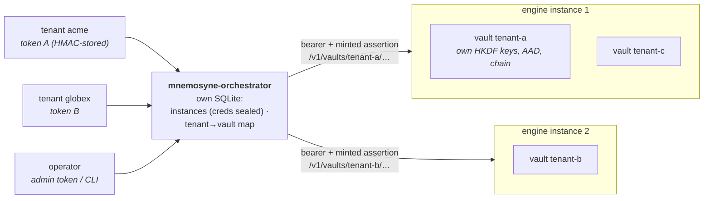
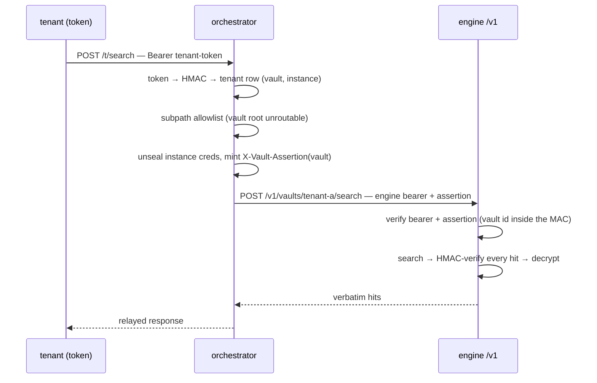
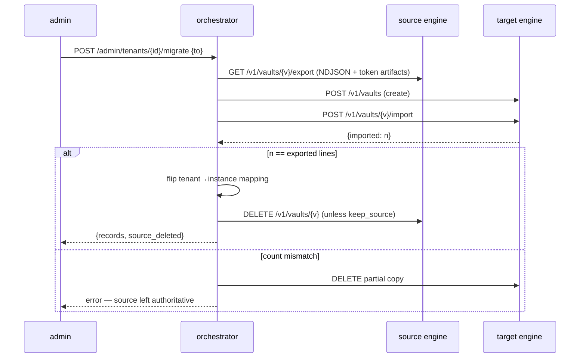

# Multi-tenancy

Mnemosyne serves many isolated tenants from one process without giving up
its core stance: local-first, verbatim storage, per-vault cryptographic
isolation, append-only audit chains. This document describes the two-layer
model it uses, maps a common external multi-tenant design onto what
Mnemosyne already implements, and records the design decisions behind the
gaps that were deliberately *not* closed inside the engine.

The unit of tenancy is a **vault**, not a palace. One process hosts one
palace; each customer/tenant gets a vault inside it, with its own
HKDF-derived keys, its own sealed store, and its own audit chain. Nothing
in a vault is reachable from another vault without the right key — isolation
is cryptographic, not merely logical (see [Cross-vault isolation](#cross-vault-isolation)).

## Two layers: engine and orchestrator

Multi-tenant memory splits cleanly into two concerns, and Mnemosyne keeps
them apart on purpose:

- **Engine** — the per-vault memory store. It is *tree-blind*: it knows
  vaults, wings, rooms, and drawers, but nothing about which tenant maps to
  which vault, how to route a request, how to migrate a vault between hosts,
  or how to mint keys for a new customer. This is what ships in the box:
  `mnemosyne-store` (per-vault SQLite + hybrid search), `mnemosyne-vault`
  (keys, sealing, audit chain), and the `/v1` REST surface in
  `crates/mnemosyne-cli/src/tenant.rs`.
- **Orchestrator** — routing, tenant→vault mapping, token minting, migration,
  instance-pool provisioning, blast-radius isolation. This layer stays
  **out of the engine** so the engine remains tree-blind and portable. It
  **ships as the separate, optional `mnemosyne-orchestrator` binary**
  (`crates/mnemosyne-orchestrator`) — a pure client of the `/v1` surface,
  never a dependency of the engine. See
  [The orchestrator](#the-orchestrator) below.

Keeping the orchestrator outside the engine means a single-instance
deployment carries none of its weight, and the engine stays a
self-contained, auditable memory store you can run by hand.

## The `/v1` engine surface

The multi-tenant REST layer lives in the same process and behind the same
palace bearer as `serve-http`, and adds per-vault enforcement plus vault
lifecycle over HTTP. Routes (see `tenant.rs`):

| Method + path | Purpose |
|---|---|
| `POST /v1/vaults` | create a vault (`sealed` or `hmac-only`; optional `external:<name>@<dim>` embedder identity) |
| `GET /v1/vaults` | list vault ids (bearer-gated; disabled under per-vault assertions) |
| `DELETE /v1/vaults/{id}` | delete a vault |
| `POST /v1/vaults/{id}/drawers` | save a drawer (deterministic-id upsert; opt-in cosine dedup) |
| `POST /v1/vaults/{id}/search` | hybrid search (cosine + BM25, optional reranker) |
| `DELETE /v1/vaults/{id}/drawers/{drawer_id}` | delete a drawer |
| `GET /v1/vaults/{id}/stats` · `.../stats/history` | stats (records, wings, rooms, kg, tunnels, db size, chain head) + sample ring |
| `GET /v1/vaults/{id}/drawers` · `GET`/`PUT .../drawers/{drawer_id}` | paged browse, full drawer, verbatim content replace |
| `GET /v1/vaults/{id}/taxonomy` | wing → room tree with counts |
| `POST /v1/vaults/{id}/verify` · `POST .../rotate` | integrity report · key rotation (sole-writer contract) |
| `GET /v1/vaults/{id}/export` · `POST .../import` | lossless migration pair |
| `GET /ui` | vault admin console (static page, every build) |

Stores are opened on demand and cached in a `HashMap` — the `tiny_http`
request loop is sequential (single-threaded), so the cache needs no locking
(`Tenancy` in `tenant.rs`).

## Mapping an external multi-tenant design onto Mnemosyne

A common external design for multi-tenant memory lists six requirements
(§1–6 below). Mnemosyne already implements §1–4 and §6 — often more
hardened than the reference — and takes a deliberate, different position on
§5.

### §1 — Vault-per-tenant isolation — implemented

Each tenant is a vault with its own key material and store. See
[Cross-vault isolation](#cross-vault-isolation).

### §2 — Signed per-request assertions — implemented (verbatim)

A palace-wide bearer can't isolate tenants: whoever holds it addresses every
vault. So when `MNEMOSYNE_ASSERTION_SECRET` is set, every vault-addressing
request must also carry a short-lived per-vault assertion
(`crates/mnemosyne-cli/src/assertion.rs`):

```
X-Vault-Assertion: <ts>:<hex>
  where hex = HMAC-SHA256(secret, "<ts>|<vault_id>")
```

- The **vault id is inside the MAC**, so an assertion minted for vault A
  never authorizes vault B (this is the core multi-tenant guarantee, and has
  a dedicated test: `assertion_for_vault_a_never_authorizes_vault_b`).
- The timestamp is checked against a **±120 s window** (`DEFAULT_WINDOW_SECS`)
  before any MAC work — cheap replay rejection.
- Comparison is **constant-time** (`subtle::ConstantTimeEq`) with a length
  guard first.
- Rejection reasons are logged server-side but **never returned to the
  caller** — they would leak whether a vault exists or how close a forgery
  got. All map to HTTP 401.

The caller platform authenticates its user and mints the assertion; the
engine verifies independently, so a compromised caller component that lacks
the secret gets nothing.

### §3 — At-rest encryption — implemented (stronger)

The reference proposes `[0x01][nonce][ciphertext]`. Mnemosyne's
`mnemosyne-vault` layer is stronger:

- **Per-vault keys via HKDF** from the master key (`keys.rs`) — each vault
  derives its own content, MAC, and fingerprint keys; keys live in
  `SecretKey` (zeroize-on-drop, never `Debug`-printed).
- **XChaCha20-Poly1305** content sealing plus an **HMAC-SHA256 integrity
  tag** per record (`seal.rs`).
- **AAD binds the vault id** into every sealing operation, so ciphertext
  from vault A cannot be verified or opened as vault B — cross-vault access
  fails *cryptographically*.
- A **tamper-evident audit chain**: every write advances the committed head
  in the same SQLite transaction as its data (`chain_append` + the
  `chain_meta` row; the manifest keeps a lagging out-of-database rollback
  anchor), and every read verifies the record HMAC before returning.
- Sealed vaults never persist plaintext or any plaintext-derived index
  (embeddings, FTS) to disk — enforced by tests.

### §4 — Vault lifecycle over the API — implemented

Create / delete / stats / export / import are all `/v1` routes (table
above). Export/import is a **lossless** decrypt-then-verified-reimport pair
for migrating a vault between instances.

### §5 — Cosine dedup-refresh on the write path — deliberately NOT the default

The reference makes an automatic cosine-≥0.95 dedup-refresh part of the
write path. Mnemosyne **rejects that as a default** because it conflicts
with the engine's invariants:

- **Non-deterministic / embedder-dependent** — a cosine threshold makes the
  write outcome depend on the current embedding model. Drawer ids are
  deterministic over `(wing, room, source, chunk_index, normalize_version)`
  precisely so re-mining is idempotent and reproducible; a cosine gate
  breaks that.
- **Lossy merge of two verbatim records** — collapsing two
  distinct-but-similar drawers discards user data on the write path, which
  the "store verbatim, never lossy-compress" invariant forbids.
- **In-place mutation vs append-only + audit chain** — silently overwriting
  a record is at odds with the append-only, chained history.

What Mnemosyne does instead:

- **Default write path is deterministic-id `upsert`** (`POST /v1/.../drawers`
  with no `dedup_threshold`): re-ingesting the same logical drawer refreshes
  it by id, idempotently and append-only-friendly.
- **Cosine dedup is opt-in and audited, never silent.** A caller may pass
  `dedup_threshold` per request; then `save_with_dedup` scans the same
  wing+room for the closest existing drawer ≥ threshold and, if found,
  **refreshes it as an ordinary audited update** (re-tagged, chain advanced)
  — explicitly *not* a silent overwrite. Off by default.
- **Non-destructive near-dup handling** for distinct records: a
  `check-dup`-style report (keyed HMAC fingerprints, `manage.rs`) surfaces
  candidates, and a **KG-supersede** merge (`kg_supersede`, `kg.rs`) appends
  the new record and marks the old one superseded in the chain — history is
  preserved, nothing is overwritten.

### §6 — External embedder + identity lock — implemented

A vault can record an external-embedding identity (`external:<name>@<dim>`)
at create time (`create_vault` in `tenant.rs`); subsequent opens enforce
that identity so a silent model swap is refused. Callers supply the vector
per request for external vaults.

## Cross-vault isolation

Isolation is cryptographic, not logical:

- Per-vault HKDF keys mean vault A's data can't be decrypted with vault B's
  keys.
- AAD binds the vault id into every seal, so even a ciphertext copied
  across vaults fails verification.
- Under per-vault assertions, an assertion for A is a 401 against B (the id
  is in the MAC).

A logic bug in routing therefore cannot leak content across tenants — the
worst case is a failed decrypt/verify, not a silent cross-tenant read.

## Reranker sharing (v0.13.0 follow-up)

The optional cross-encoder reranker is a heavy ONNX model. Loading a copy
per vault would be wasteful, so the multi-tenant server loads the model
**once** and hands every per-vault store a cheap `Arc` handle onto that
single shared model:

- `RerankerFactory` (`tenant.rs`) produces a `Box<dyn Reranker>` per store
  open; each call clones a handle onto the one shared model.
- `Tenancy::with_reranker()` attaches the shared reranker to every store as
  it opens; `None` ⇒ first-pass ranking only (the default).
- `main.rs` loads one `OnnxReranker` when `MNEMOSYNE_RERANKER=onnx` (off by
  default; bails without the `onnx` feature) and wires it at the `serve`
  call site. Worst case is two loads — the single MCP store plus the shared
  tenant factory — mirroring how the embedder factory already handles the
  single store's embedder.

Reranking is CPU-bound and single-threaded (tract), so on a single instance
it bounds throughput; `MNEMOSYNE_RERANK_TOP_N` (default 50) bounds
per-query latency. Measured lift: LoCoMo R@10 94.6 → **97.68** (see
[benchmarks/RESULTS.md](../benchmarks/RESULTS.md)).

## The orchestrator

`mnemosyne-orchestrator` (shipped v0.25.0) is the control plane the design
above reserved: one binary, its **own** SQLite state, talking to engines
exactly like any other `/v1` caller — palace bearer + freshly minted
per-vault assertion per request. Nothing in it links engine crates.

**Topology** — tenants talk to the orchestrator; the orchestrator talks
to engines over their public `/v1` surface; every engine hosts many
cryptographically isolated vaults:



**Data-plane request** — one hop, auth swapped at the boundary, and the
engine still verifies everything independently:



**Migration** — the v0.18 artifact-carrying export/import as a live
control-plane operation; any failure before the mapping flip leaves the
source authoritative:



**Surface** (single-threaded `tiny_http`, the engine's serving model):

| Route | Plane | Purpose |
|---|---|---|
| `GET /healthz` | — | unauthenticated liveness |
| `GET /ui` | — | the fleet console: a static page driving the whole admin plane (instances, tenants with one-time token reveal, guarded rotation/deletion, migration); the admin token is entered in the page |
| `POST/GET /admin/instances`, `DELETE /admin/instances/{name}`, `GET .../{name}/health` | admin | instance registry (+ live engine probe); removal refused while tenants map to it |
| `POST/GET /admin/tenants`, `DELETE /admin/tenants/{id}` | admin | tenant lifecycle: pick instance (least-loaded default) → create engine vault → record mapping → **return the token once** |
| `POST /admin/tenants/{id}/migrate` | admin | live migration (below) |
| `ANY /t/<subpath>` | data | tenant-token-routed proxy onto `/v1/vaults/{vault}/<subpath>` |

The admin plane sits behind `MNEMOSYNE_ORCH_ADMIN_TOKEN`; every auth
failure is a uniform 401. The CLI (`instance-add`, `tenant-create`,
`migrate`, …) mirrors the admin plane for scripted use, plus `keygen`.

**Security model** — the orchestrator state is credential-bearing, so it is
hardened the way the engine hardens its own secrets:

- Engine credentials (bearer + assertion secret) are **sealed at rest**
  (XChaCha20-Poly1305 under `MNEMOSYNE_ORCH_KEY`, AAD-bound to the instance
  name — a blob copied onto another row fails to open, mirroring the
  engine's vault-id AAD binding).
- Tenant tokens are **never stored** — only a domain-separated HMAC; the
  token appears exactly once, in the create response.
- The data plane maps a token to **its own vault only**: there is no path
  shape that reaches another tenant, the subpath allowlist keeps vault
  lifecycle off the data plane (the vault root is unroutable), and even a
  routing bug downstream fails cryptographically — the assertion and the
  vault AAD both carry the vault id.

**Migration** (`POST /admin/tenants/{id}/migrate {"to": …}`): export from
the source (the v0.18 artifact-carrying NDJSON, so token matrices restore
by copy, not re-encode) → import on the target → **count-verified** →
mapping flip → source vault delete (`keep_source` opts out). Any failure
before the flip leaves the source authoritative and removes the partial
copy. The e2e suite (`tests/e2e-orchestrator.sh`, 24 checks,
`docker compose run --rm orchestrator-e2e`) exercises the whole story
against two live engine instances, including the source engine provably
losing the vault after migration.

### Deploying the orchestrator (hardening)

- **Bind loopback, terminate TLS in front.** The orchestrator (like the
  engine) listens on `127.0.0.1` by default and speaks plain HTTP; put a
  reverse proxy (Caddy, nginx, or your ingress) in front for TLS and let
  it forward to the loopback port. The same applies to the
  orchestrator→engine hop when engines live on other hosts: point the
  instance `url` at an HTTPS reverse proxy in front of each engine.
  Everything auth-bearing (tenant tokens, engine bearers, assertions)
  must only ever transit inside TLS or on loopback.
- **Rate limiting** (`MNEMOSYNE_ORCH_RATE_LIMIT`, requests/minute per
  tenant, off by default): applied on the data plane *after* token
  resolution, keyed per tenant — one noisy tenant is throttled (429),
  the rest are untouched. Blast-radius isolation, applied to request
  volume.
- **Token rotation** (`POST /admin/tenants/{id}/rotate` or
  `tenant-rotate`): mints a fresh token and revokes the old one **in the
  same statement** — rotation *is* the revocation primitive; there is no
  grace window. The new token appears once, in the response.
- **State backup and the single-writer stance.** The orchestrator state
  is one SQLite file: credentials sealed, tokens MAC-only — a copied
  file without `MNEMOSYNE_ORCH_KEY` yields nothing. Back it up like any
  file; losing it strands no data (tenant data lives in engine vaults —
  re-register instances, re-mint tokens). It is deliberately
  **single-writer**: run one orchestrator per fleet. Multi-orchestrator
  replication is deferred until a fleet actually needs it — a
  read-replica proxy is the likely shape, not multi-master.
- **Secrets hygiene**: generate `MNEMOSYNE_ORCH_KEY` and the admin token
  with `keygen`; pass them as environment, never in URLs. On shared
  hosts prefer the HTTP admin plane over CLI flags for instance
  registration (argv is visible to other local users).

## Latency and the orchestrator compose cleanly

The single-threaded `/v1` loop with reranking has a throughput ceiling
(~1 reranked query/sec/core). The two scaling levers stack:

- **Per-query parallelism** (rayon over the rerank/verify loop) cuts
  *single-instance* latency.
- **Orchestrator instance-pool + dedicated-store provisioning** gives
  *multi-tenant throughput* and blast-radius isolation — one tenant's load
  or a poisoned store can't stall another.

The first lives in the engine; the second lives in the orchestrator. That
separation is the whole point: the engine stays a portable, auditable,
tree-blind memory store, and scale-out is an optional layer on top.
