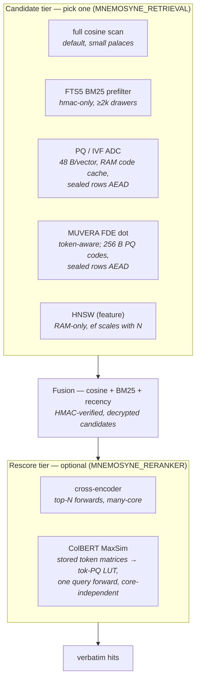

# Retrieval scaling & latency

How Mnemosyne retrieves, where the time and memory actually go (measured), and
the architecture for scaling to large corpora **without** trading one problem
for another. Local-first and the sealed-vault invariants constrain the design
throughout: sealed vaults never persist a plaintext-derived index to disk.

## The pipeline today

`search` runs three stages:

1. **Candidate generation** — pull candidates. Default: full O(n) cosine scan
   over the decrypted embeddings (an FTS5 BM25 prefilter narrows it for large
   *hmac-only* vaults). An experimental in-memory HNSW prefilter exists behind
   the off-by-default `hnsw` feature.
2. **Fusion** — cosine + Okapi BM25 (+ recency), the hybrid rank.
3. **Reranking (optional)** — a cross-encoder re-scores the top-N by the full
   `(query, passage)` pair.

The full tier map as shipped (every tier measured in this document; at
both vault levels the derived artifacts follow the sealing invariant):

## Measured costs (LoCoMo, 1,982 QA, and synthetic corpora)

Two costs dominate, and they are **independent** — conflating them is the trap.

### Cost 1 — scoring: the reranker

| Config | R@10 | Latency/query |
|---|---|---|
| hash + BM25 (no model, no reranker) | 94.6% | ~6 ms |
| MiniLM + BM25 (bi-encoder) | 94.6% | ~128 ms |
| + cross-encoder reranker | ~98% | **~16,600 ms** |

The reranker buys **+3 pts** but costs **~2,700×** the fusion-only search: it
runs ~60 full cross-encoder forward passes per query (one per candidate,
~277 ms each). The embedder choice is noise next to it (hash+reranker and
MiniLM+reranker are within 1%). BM25 fusion, by contrast, is a **free** +1.9 pts
over legacy/rrf. On LoCoMo, MiniLM over hash is a wash under BM25 — the model
earns its keep only with weaker fusion.

### Cost 2 — candidate generation at scale (synthetic, hash embedder)

| N | full-scan q/s | in-mem HNSW q/s | speedup | HNSW Recall@5 |
|---|---|---|---|---|
| 2,000 | 31.4 | 402.7 | 12.8× | 100.0% |
| 5,000 | 12.3 | 390.7 | 31.7× | 99.7% |
| 20,000 | ~3 | 321.2 | ~100× | 92.4% |
| 50,000 | ~1.2 | 271.0 | ~225× | 60.3% |

Full-scan is O(n)/query; HNSW holds ~270–400 q/s regardless of n. The win is
real and grows without bound — **but** the in-memory prototype has two flaws:

- **RAM is O(corpus)** (~1.5 KB/vector + graph edges → ~2–2.5 GB per million
  vectors), plus a full-corpus decrypt + rebuild on every open. Infeasible for
  IoT or billion-scale. *In-memory solves latency by creating a memory problem.*
- **Recall collapsed at a fixed search beam** — root cause: the store asks the
  index for ≥256 candidates but `instant-distance` builds with `ef_search=100`,
  so every query's candidate tail came from an exhausted beam, and it worsened
  with n. **Fixed in v0.22.0** by scaling `ef_search` ~n/64 (floor 320, cap
  1024) and `ef_construction` ~n/256 at build: R@5 93.1→**98.8%** at 20k,
  71.7→**96.3%** at 50k, still 126–186 q/s (the bigger beam trades raw speed
  — previously 378 q/s at 50k *with unusable recall* — for accuracy that
  degrades gently instead of collapsing). LoCoMo real-data parity: R@10
  94.6% identical to the full scan at 6.7 vs 5.3 ms/q.

So in-memory HNSW is a **fast option when RAM allows**, not the destination —
the O(corpus) RAM flaw stands.

## The architecture: two costs, two purpose-built fixes

### Retrieval → on-disk PQ (bounded RAM), not in-memory HNSW

Product Quantization compresses each vector ~32× (1.5 KB → 48 bytes). Only the
~400 KB codebook stays resident; the codes live **on disk** and search streams
ADC over them. RAM is bounded at any corpus size — the standard
billion-scale-on-modest-RAM design.

**Shipped (flat PQ prefilter, hmac-only vaults)** — the invariant rule mirrors
FTS5: hmac-only vaults may hold plaintext-derived indexes on disk, sealed
vaults never do (their encrypted-at-rest variant is the research follow-up).
`set_pq(true)` / `MNEMOSYNE_RETRIEVAL=pq`; codes maintained incrementally on
write with FTS-style self-heal. Measured (synth, hmac-only, N=20k):

| Mode | N=20k q/s | N=20k R@5 | N=50k q/s | N=50k R@5 | RAM |
|---|---|---|---|---|---|
| true full-scan | ~6.6 (extrap.) | 100% | ~2.6 (extrap.) | 100% | transient O(n) |
| FTS prefilter (default) | 76.7 | 100% | 33.2 | 100% | on-disk |
| **PQ prefilter** | 59.2 | **98.6%** | 18.6 | **98.9%** | **codebook only** |
| in-memory HNSW | 454.1 | **93.1%** | 377.7 | **71.7%** | O(corpus) |

The differentiator, now confirmed at both sizes: **PQ recall is flat in N**
(98.6% → 98.9% — ADC is exhaustive over the codes, quantization error only),
where HNSW's graph approximation collapsed without per-N tuning (93% → 72%
in this table's run; the v0.22.0 ef-scaling fix lifts it to 98.8%/96.3% at
~126–164 q/s — see the flaws list above). PQ's flat scan is still O(n) —
q/s falls ~linearly (59 → 19), ~3–9× the true scan. HNSW is the raw-speed
option when O(corpus) RAM is acceptable.
**Still open:** the sealed-tier encrypted index.

### IVF inverted lists — and the three scan bottlenecks the sweeps exposed

IVF was built to make the flat ADC scan sub-linear: a coarse quantizer
(`nlist ≈ √N` centroids, same deterministic k-means) partitions the codes,
and a query ADC-scans only the `nprobe` nearest lists. Benchmarking it
(synthetic corpus, hash embedder, hmac-only, 4,000 sampled queries per cell,
second 24-core host — absolute q/s not comparable to the tables above;
every comparison below is within one run) surfaced three structural costs,
each fixed and re-measured:

1. **Random-access layout.** With codes keyed by `seq` + a secondary `list`
   index, every probed row was a point B-tree fetch — a 23%-fraction probe
   ran *slower* than the sequential flat scan (16.6–22.6 q/s vs 26.5 flat
   at N=20k, and recall tracks the probed **fraction**: 3% → 68.7%,
   11% → 86.9%, 23% → 99.6% = flat parity). Fix: cluster the table
   `WITHOUT ROWID, PRIMARY KEY (list, seq)` so a probed list is one
   sequential range scan, and default `nprobe = nlist/4` (a fixed count
   would silently lose recall as N grows). Result: probed 23% beat flat
   28.6 vs 23.9 q/s at recall parity.
2. **Per-search coherence check.** The matched-count `JOIN` that guarded
   against index drift cost more at N=50k than the probed scan it guarded
   (IVF only +13% over flat). Fix: verification is event-driven — first
   search after open, or after a write that couldn't encode; a successful
   incremental encode is coherent by construction. Crash drift is still
   caught (a fresh open starts unverified).
3. **Per-row join in the scan itself.** The scan joined `drawers` on every
   code row only to exclude delete-orphans — one point lookup into the big
   drawers B-tree per code (12.5k/query probed, 50k flat). Fix: scan
   `drawer_pq` alone; `delete_drawer` purges its code row; a crash-window
   orphan wastes one of 256 over-fetched candidate slots and is swept by
   the next rebuild.

**Final numbers** (within one uncontended run, after all three fixes):

| N | flat PQ q/s | IVF-default q/s | R@5 (both) |
|---|---|---|---|
| 20,000 | 34.4 | **38.3** (+11%) | 99.6% |
| 50,000 | 14.8 | **15.9** (+7%) | 99.1% |

The fixes lifted the **flat** path itself ~45% (23.9 → 34.4 q/s at N=20k,
10.1 → 14.8 at 50k, same-host same-run comparisons) — every PQ user gets
that. IVF's *marginal* win on top is +7–11% at these sizes because the pure
ADC arithmetic is now only ~4–6 ms even at 50k; its share (the only part of
query cost that scales with N) grows with the corpus, so IVF is kept on by
default above `MNEMOSYNE_IVF_MIN` (8192; `off` restores the flat scan,
`MNEMOSYNE_IVF_NPROBE` overrides the probe count). Recall parity, in-place
migration from the v0.14.0 layout, and self-healing partitions (retrain when
the corpus doubles past their training size) are all test-asserted.

### Scoring → two strategies, chosen by the deployment

The +3 pts comes from a **cross-encoder** reranker, which runs one full forward
**per candidate at query time**. That per-candidate cost is the whole problem,
and the right handling depends on how many cores the box has.

#### Cross-encoder + rayon — the many-core option (shipped)

Rerank the top `top_n` fusion candidates, fanning the independent forward passes
across cores. Measured on LoCoMo:

- **rayon (done):** sequential 16,600 ms → **1,103 ms/query on 24 cores (~15×)**,
  R@10 99.0% unchanged.
- **`top_n` as a true pool cap (done):** rerank exactly the top `top_n`, the tail
  keeps fusion order. `top_n=20` → **694 ms @ 98.7%** (the accuracy knee),
  `top_n=10` → **389 ms @ 97.4%**. Net ~24–43× over the original.

**But this is O(top_n / cores):** latency ≈ ⌈`top_n`/cores⌉ × one-forward. On a
24-core host `top_n=20` is one wave; on a **4-core** box it is 5 waves (~270 ms)
— the strategy doesn't scale *down*. Sweet spot: `top_n = min(accuracy-plateau,
cores)`; when `top_n < cores`, give each forward `cores/top_n` intra-op threads
so no core sits idle. This is fundamentally a **many-core optimization.**

#### ColBERT late interaction — the core-independent option (shipped, measured)

A cross-encoder is slow because it encodes each `(query, passage)` pair at query
time. Late interaction encodes passage tokens **once at ingest** (stored on
disk, int8-quantized; sealed vaults AEAD-seal every matrix under a distinct
`/tok` AAD domain — the first encrypted-at-rest derived store) and, per query,
does **one** query-encode forward plus a cheap **MaxSim** (max-cosine per query
token, summed) — plain arithmetic, **no transformer per candidate**. Query cost
is **~one forward, independent of `top_n` and of core count**. ColBERT is
BERT-family, so it runs in tract (unlike the DeBERTa rerankers tract rejects).

**Measured** (LoCoMo full 1,982 QA, hash embedder + colbertv2.0; tract and
ORT rows are the same exports, same host):

| Second stage | R@10 | search ms/q | scales w/ cores |
|---|---|---|---|
| none (bm25 fusion) | 94.6% | ~6 | — |
| ColBERT late interaction (tract) | 96.77% | 92.7 | no — same on 4 or 24 |
| ColBERT (`ort`, int8-MaxSim) | 96.8% *(same 1918/1982)* | 81.6 | no |
| **ColBERT (`ort` + token-PQ LUT)** | **96.5%** | **70.3** | **no** |
| cross-encoder (ort int8, `top_n=20`) | 97.68% | 101–327 *(24-core)* | yes — ~5× worse on 4 cores |

+2 pts over fusion at a flat ~70–93 ms/query; the cross-encoder buys ~1 more
point but only at many-core prices. Recall is **runtime-invariant as
measured**: tract and ORT int8-MaxSim recall the identical 1918 of 1982.
Ingest carries the moved cost — one doc forward at write time, and the `ort`
doc forward cut the bench's full-ingest phase **821 → 246 s (3.3×)**. Two
honest notes from the ORT run: (1) the token-PQ LUT win is now visible
(+4 ms *slower* under tract, **−11 ms** under ORT — the tract row amortized
its one-time codebook train+repack behind a slower forward); (2) the
tract→ORT delta on the int8 path is ~11 ms, so the seq-32 query forward was
never the ~80 ms v0.20.0 estimated — **the residual ~70 ms is store-side**
(candidate token fetch/decode + MaxSim + fusion), which is the next lever.
Enable with
`MNEMOSYNE_RERANKER=colbert` + `MNEMOSYNE_COLBERT_MODEL` (doc export) /
`_QUERY_MODEL` (query export) / `_TOKENIZER`; the cross-encoder wins when both
stages are configured. Drawers written before the encoder was attached keep
their fusion rank (never sunk); export recipe below.

**Export recipe** (models are user-supplied, as always): wrap the checkpoint's
BERT + its `linear.weight` projection + L2-normalize in one module and export
**fixed-shape** ONNX at query (32) and doc (256) lengths — the dynamo exporter
emits `Min(512, seq)` symbolic dims and dynamic-axes legacy exports emit a
`Range` op, both of which tract rejects; fixed shapes bake `arange` into
constants and load clean.

**So: cross-encoder+rayon is the accuracy ceiling on big boxes; ColBERT is the
portable answer for the common 4-core / edge deployment.**

### Inference runtime → tract (pure-Rust) or ONNX Runtime (fast)

Every forward above goes through an inference runtime. Per-forward latency, same
onnx models, seq 256, on this CPU (`avx512_vnni`, no GPU reachable):

| Model | tract (pure-Rust) | ORT fp32 1-thr | ORT fp32 all | ORT int8 1-thr | ORT int8 all |
|---|---|---|---|---|---|
| MiniLM embed | ~128 ms | 53.7 | 28.1 | 24.9 | **15.0** |
| cross-encoder | ~140–277 ms | 56.2 | 26.8 | 24.4 | **13.3** |

**ORT is ~2.5× faster than tract per forward, int8 (VNNI) ~2× more** — validated
in Rust via the `ort` crate (matches Python onnxruntime; same C++ backend).
Accuracy is **runtime-invariant** (identical weights). Tradeoff: `ort` links
ORT's **C++** library, breaking the pure-Rust / zero-C-dep property (audit
surface, wasm/IoT — though ORT ships mobile/wasm builds). Offered
**feature-gated (`ort`), tract kept as the pure-Rust fallback**
([`mnemosyne-embed-ort`](../crates/mnemosyne-embed-ort)). The CLI wires it
end to end: build with `--features ort` and select at runtime with
`MNEMOSYNE_EMBEDDER=ort` / `MNEMOSYNE_RERANKER=ort` (cross-encoder) /
`MNEMOSYNE_RERANKER=colbert-ort` (late interaction) — same model files and
`MNEMOSYNE_ONNX_*` / `RERANK_*` / `COLBERT_*` variables as tract.

Measured **end-to-end** on LoCoMo (convos 0-1, 302 QA), this 24-core host.
`OrtReranker` holds a **session pool** (default = core count,
`MNEMOSYNE_ORT_POOL`; `pool=1` = one all-core batched session, the few-core
mode) and fans the independent forwards across it:

| Reranker config | top_n=20 | top_n=10 | top_n=5 | R@10 |
|---|---|---|---|---|
| tract + rayon | 694 ms | 389 ms | 321 ms | 98.7 / 97.4 / 97.4 |
| ORT batched (pool=1) | 614 ms | 386 ms | 251 ms | same |
| ORT session-pool fp32 | 427 ms | 214 ms | 142 ms | same |
| **ORT session-pool int8** | **327 ms** | **171 ms** | **101 ms** | 98.3 / 98.0 / 98.0 |

Ingest embed: tract ~24 s → ORT ~5 s (**~4–5×**). int8 accuracy is within noise
of fp32 (±1–2 questions of 302). Net: the reranker went **16.6 s → ~101–171 ms
(~100–160×)** at ~98% R@10. Two structural notes: (1) concurrent forwards
contend for memory bandwidth (BERT is memory-bound), so a wave costs more than
an isolated forward — int8's 4× smaller weights attack exactly that, and int8
needs **no code change** (point `MNEMOSYNE_RERANK_MODEL` at a quantized file);
(2) on a **4-core** box use `pool=1` (batched) — tract+rayon degrades to waves
there while one ORT forward uses whatever cores exist. On a GPU target,
ORT-CUDA takes each forward to ~1–5 ms.

### ColBERT build plan (shipped — see the measured section above)

Landed as designed: `LateInteraction` trait (`mnemosyne-core/src/late.rs`) +
`OnnxColbert` on tract (`mnemosyne-embed-onnx/src/late.rs`, two fixed-shape
plans); ingest-time doc encode → int8 token matrices (per-row scale) in
`drawer_tok`, sealed vaults AEAD-seal each matrix (`Vault::tokens_at_rest`,
`/tok` AAD domain); one query forward + MaxSim rescore of the fusion top-N
(`mnemosyne-store/src/latestage.rs`), opt-in via `MNEMOSYNE_RERANKER=colbert`.

Still open on this path:
1. **`ort` backend for the query forward — shipped, measured** (`OrtColbert`
   in `mnemosyne-embed-ort/src/late.rs`, same exports/env as tract): search
   92.7–96.7 → **70.3 ms/q** with the token-PQ LUT, ingest 3.3× faster,
   recall runtime-invariant. The measured split shows the remaining ~70 ms
   is store-side, not the forward — see the measured section above.
2. **PLAID-style residual/PQ compression** of the token store (int8 today,
   ~4×; PQ would give ~32× like the retrieval codes).
3. **Punctuation filtering** on doc rows (ColBERT convention; small win).
4. **Cross-encoder path** (independent): a true batched
   `OnnxReranker::score_batch` in tract (blocked by a fixed batch-dim-1
   model load).

## Security tiering (same invariant, applied per level)

| Vault level | Retrieval index | Token/rescore store | RAM |
|---|---|---|---|
| **hmac-only** | on-disk IVF-PQ (plain) — shipped | on-disk ColBERT tokens (plain) — shipped | bounded |
| **sealed** | IVF-PQ **encrypted at rest** — shipped | ColBERT tokens **encrypted at rest** — shipped | bounded (decrypt-once cache) |

**Sealed IVF-PQ, measured** (synth, 4,000 sampled queries, within one run):
every code row is AEAD-sealed (`list ‖ code`, bound to its seq under the
`/pq` AAD domain — a plaintext list id would leak semantic clustering), the
codebook/centroids are sealed in `pq_meta`, and search decrypts all rows
**once per open** into a ~52 B/drawer RAM cache and ADC-scans there. An
offline attacker sees fixed-size sealed blobs — the drawer count it already
knows.

| Sealed vault | N=20k q/s | N=20k R@5 | N=50k q/s | N=50k R@5 |
|---|---|---|---|---|
| decrypt-scan (old only option) | 2.1 | 99.9% | 1.1 | 99.9% |
| **sealed IVF-PQ** | **33.4 (×16)** | 99.6% | **11.8 (×11)** | 99.1% |
| hmac-only IVF-PQ (within-run ref) | 37.1 | 99.6% | 8.1 | 99.1% |

Encryption stops being a query-time cost: at 20k the sealed path runs at
~90% of the plaintext index, and at 50k it *beat* the within-run plaintext
reference — the decrypt-once RAM cache skips the per-query SQLite code
streaming that hmac-only paid (cross-run note: a quieter v0.15 run
measured hmac@50k at 14.8 q/s, so treat the 50k ordering as parity, not a
sealed win). The obvious follow-up — give hmac-only the same cache — landed
in v0.22.0 and the cross-run caveat proved right: a controlled before/after
(same host, back-to-back builds) measured **parity within run-to-run noise**
at both sizes (hmac 36.1→34.1 q/s @20k, 14.3→15.2 @50k, while *unchanged*
sealed cells swung ±8–10% between the same two runs), identical recall
everywhere. Both levels now share the one cache-scan code path — kept for
the simplification, not a claimed speedup.

hmac-only content is already unencrypted on disk, so on-disk indexes are
invariant-consistent — this mirrors the existing on-disk FTS5, which sealed
vaults never get (FTS is inherently a plaintext structure). Sealed vaults now
keep the same PQ/IVF structures **encrypted at rest** with a decrypt-once RAM
cache (~52 B/drawer — 5 MB per 100k drawers, bounded). The remaining research
refinement is *page-level* decryption (decrypt only probed lists instead of
all codes at open) — worthwhile only past the multi-million-drawer mark where
the cache warmup itself gets heavy.

### Page-level decryption at 10⁶–10⁷ (research spike, measured)

The spike (`mnemosyne-bench pqpage-synth`) put numbers on that refinement:
today's per-row seals + decrypt-once cache versus **one AEAD page per IVF
list** (AAD `pqpage/{list}`; sealed plaintext `count ‖ (seq ‖ code)*` — the
count is a row-count commitment, covered by the AEAD) decrypted lazily per
probe. Both variants scan byte-identical synthetic codes, so recall is
invariant by construction and only the costs differ. Three shapes per cell:
**A-flat** (the shipped format and cache verbatim), **A-grouped** (same
at-rest format, cache regrouped into per-list slabs at open — the
no-migration fix), **B-pages** (cold = decrypt probed pages per query;
warm = decrypt-once page cache). Within-run, one 24-core host, dim 384
(48 B codes), k=256, uniform list assignment (real clusters skew, which
widens per-probe tails but not the bytes-per-probe mean):

| n, nlist | at-rest row/page | A open (decrypt-all) | A-flat ms/q | A-grouped ms/q | B-cold ms/q (MB dec/q) | B-warm ms/q | RSS A / B warm |
|---|---|---|---|---|---|---|---|
| 10⁶, 1000 | 117 / 57 MB | 2.4 s | 36.6–128.7 | 0.9–18.5 | 2.2–46.3 (0.8–14) | 0.8–15.2 | 111 / 76 MB |
| 10⁷, 1024 | 1178 / 561 MB | 22.3 s | 333–1415 | 10.0–248 | 18.5–332 (8.7–140) | 8.5–136 | 1008 / 630 MB |
| 10⁷, 3162 (√N) | 1178 / 563 MB | 20.1 s | 228–543 | 7.5–105 | 27.3–403 (8.7–140) | 7.5–131 | 1008 / 629 MB |

(Ranges span probed fractions 1.5% → 25% of the corpus; raw log
`benchmarks/logs/pqpage_spike.log`.)

What the numbers decide:

- **The urgent problem is the cache layout, not the format.** A-flat's
  per-query list filter over the whole flat cache is already 37–129 ms/q at
  10⁶ and 0.3–1.4 s/q at 10⁷ — and the shipped code path uses a linear
  `Vec::contains` where the spike used binary search, so reality is worse.
  Grouping the existing cache into per-list slabs (A-grouped) recovers
  10–36 ms/q at 10⁷'s sane fractions with **zero at-rest change** — the
  same slice-grouping fix the inverted-FDE plan already prescribes.
- **Pages pay on three axes once RAM binds**: at-rest size **2.1× smaller**
  (40 B seal overhead × nlist instead of × N, ~470 MB saved at 10⁷), open
  cost **22 s → 0** (lazy decrypt; a cold 1.5%-fraction probe costs
  ~20 ms), and RAM **630 MB warm-full vs ~1 GB** for the verbatim cache
  (partial-coverage working sets proportionally less; a cold scan needs
  ~0). Warm query latency matches A-grouped. Single-thread AEAD throughput
  measured ~700 MB/s — decrypt cost per probe is bytes-bound, so it tracks
  the probed fraction, not nlist (the 1024-vs-3162 cells decrypt the same
  MB at the same fraction).
- **Integrity resolves to the row-count commitment, not a Merkle tree.**
  The whole page is one AEAD unit — intra-page splicing, reordering, or
  selective row deletion is impossible without the key (*stronger* than
  per-row seals, where dropping individual rows is only caught by the
  matched-count verify). Whole-page replay of a stale page for the same
  list is the same trust class as today's stale-row replay: the PQ index
  is advisory and every candidate's record HMAC is verified downstream.
  The count verify keeps working via a sealed total-row-count in `pq_meta`
  written in the same transaction.
- **The plan's missing cost is write amplification**: one-page-per-list
  turns a single-drawer write into a read-modify-reseal of its whole list
  page (~550 KB at 10⁷/1024). A real implementation needs per-row *tail*
  rows (today's format, riding along like list -1 does) compacted per bulk
  batch, and/or `(list, pageno)` page caps; `upsert_many` already provides
  the batch boundary. Page blob lengths also newly reveal the cluster-size
  histogram (not membership) — pad to buckets if that ever matters.

**Decision**: stay on the shipped per-row format for now and take the
slab-grouped cache as the cheap unblocking fix; adopt the page format only
when a deployment actually hits the RAM/open-time wall (the trigger stands),
using tail rows + sealed total-count, with the migration shaped as
event-driven repack (the same train-and-repack seam every other derived
artifact already uses).

**Shipped (v0.41.0)**: the A-grouped layout is now the store's PQ cache —
slab-grouped by IVF list at both vault levels, probe scans touch only
their lists' contiguous slabs, and the IVF `nlist` clamp lifted
1024 → 4096 so √N keeps tracking the corpus past 10⁶.

**Shipped (v0.42.0)**: the B-pages format, **opt-in and default off**
(`MNEMOSYNE_PQ_PAGE_MIN=<rows>` / `set_pq_pages`; sealed vaults only).
One AEAD page per IVF list under AAD `pqpage/{list}/{pageno}` (4096-row
page caps), sealed plaintext `count ‖ (seq ‖ code)*`, lazy per-probe
decryption, sealed total-count + deleted-count in `pq_meta` keeping the
matched-count self-heal exact without page rewrites on delete/update.
Single writes ride a per-row tail folded into pages once per
`upsert_many` batch — the write-amplification bound designed above. The
migration is the event-driven repack in both directions: flipping the
setting converts at the next search's verify pass, no re-embedding. Key
rotation re-seals pages byte-exact. The per-row default remains the
recommendation until the RAM trigger fires; adopting pages is now a
config flip, not a format change.

## Restore economics — derived data is a portable, verifiable cache

Restoring or importing a shard today rebuilds the derived artifacts, and they
are wildly asymmetric: FTS re-triggers in seconds, PQ/IVF retrains in ~10–20 s
at 20k drawers — but **ColBERT token matrices cost one transformer forward
per drawer** (~2 h for 20k on tract, serial). The plan, in leverage order:

1. **Portable artifacts (transport beats recompute) — shipped.** Every
   derived artifact is a pure function of `(content, model identity)`, and
   drawer ids are already deterministic — so token matrices are
   *content-addressed cache* and ship inside `/v1` export bundles (each
   JSONL line carries optional `tok = {model, b64}`); import re-seals them
   under the destination vault's key. Restore becomes copy + verify, zero
   forwards. The architecture makes this uniquely safe: artifacts are
   advisory, model identity is matched before use, and every served result
   is still HMAC-verified — an imported artifact can only mis-rank, never
   forge (test: a destination whose encoder panics on doc-encode rescores
   correctly from imported artifacts alone).
2. **Instant restore, background accuracy — shipped.** Drawers without
   token matrices keep their fusion rank, so a restored shard serves at
   bm25 quality immediately; `mnemosyne repair --tokens` (or a daemon tick
   calling `late_backfill`) covers the gap in bounded batches — with ort
   int8 + batching + rayon (still open), ~10 min for 20k drawers instead
   of ~2 h.
3. **Token-store PQ + pruning (the PLAID move) — shipped, measured.**
   [pq.rs](../crates/mnemosyne-store/src/pq.rs) re-used on the token
   vectors: a 128-dim token is **16 PQ bytes (8.2× below int8, 33× below
   f32** — a ~150-token drawer's matrix drops 19.8 KB → 2.4 KB), and MaxSim
   scores v2 matrices via per-query-row **dot-product LUTs** (tables built
   once per query row; each candidate token costs 16 adds instead of a
   128-dim dot). Doc-side punctuation rows attend but aren't stored. The
   codebook trains event-driven from the vault's own matrices past
   `MNEMOSYNE_TOK_PQ_MIN` (default 256), persists **sealed** in `tok_meta`,
   and repacks every stored row in the same pass; v1/v2 coexist and
   portable artifacts always export as universal v1.
   **Gate met**: LoCoMo 96.57% R@10 (1914/1982) vs 96.77% plain — −0.2 pts
   for 8× storage. Search under tract was 96.7 vs 92.7 ms/q (*neutral*: the
   bench amortizes each store's one-time train+repack into the query phase,
   behind a slow forward). The `ort` query-forward follow-up **unmasked the
   LUT win as predicted**: 70.3 (LUT) vs 81.6 (int8) ms/q — an **11 ms**
   measured gain — though the forward itself turned out to be ~11 ms of
   search, not the ~80 ms estimated here; the rest is store-side. The 4-bit
   register-LUT (`std::arch`) variant remains a micro-optimization.

Nothing standard offers this combination: late-interaction retrieval whose
entire derived state is **AEAD-sealed at rest, content-addressed, portable
across backups, self-healing, and scored via register-LUT MaxSim over PQ
codes**. Recompute-everything is slow; plaintext indexes are leaky; this is
neither.

### Beyond MaxSim: MUVERA fixed-dimensional encodings (shipped, measured)

Our late-interaction stage *scores* candidates with MaxSim — cheap
arithmetic, but the candidate pool came from the single-vector fusion stage,
which knows nothing about token-level similarity, and hydrating+verifying
that pool was the measured ~70 ms/q dominant term. **MUVERA** (Dhulipala,
Jayaram et al., Google Research — arXiv:2405.19504) closes the gap: compress
each token *matrix* into one **fixed-dimensional encoding** (FDE) such that
a plain inner product of two FDEs approximates Chamfer/MaxSim, with proven
ε-approximation bounds. The construction is model-free randomization —
SimHash buckets, per-bucket aggregation (query sums, doc centroids with
Hamming `fill_empty_clusters`), a ±1 projection — no training, composes with
any ColBERT-style encoder.

**Shipped** (`mnemosyne-core/src/fde.rs` + `mnemosyne-store/src/fdeidx.rs`,
`MNEMOSYNE_RETRIEVAL=fde`): seed-deterministic encoders (params + seed
persist sealed in `fde_meta` — query and doc sides must agree bit-for-bit,
and restores keep scoring identically); `drawer_fde` rows written from the
token matrix already in hand at ingest, AEAD-sealed on sealed vaults under
the `/tok` domain (`fde/{id}` labels); event-driven backfill from stored
matrices (pure arithmetic — **no transformer**); a load-once `(seq, fde)`
RAM cache; candidates by FDE dot ahead of fusion, MaxSim rescore unchanged.
The query forward is shared between candidate generation and rescore — one
search, one forward. Default params `8 reps × 16 buckets × 16 proj` →
2048-dim FDEs (8 KB/drawer; `MNEMOSYNE_FDE_REPS/_KSIM/_DPROJ/_SEED`).

**Measured, end-to-end** (LoCoMo full 1,982 QA, hash embedder + ort
colbertv2.0 + token-PQ LUT, same host as the v0.21.0 rows):

| Candidate stage | R@10 | search ms/q |
|---|---|---|
| fusion (v0.21.0 baseline) | 96.5% (1913) | 70.3 |
| **MUVERA FDE top-256** | **96.5% (identical 1913)** | **52.9 (−25%)** |

Recall is question-for-question identical — the FDE head kept everything the
pipeline needed — and latency drops because the fusion stage now hydrates
and verifies 256 candidates instead of the whole store: the FDE attacks
exactly the term v0.21.0 exposed.

**Measured, mechanics at scale** (`mnemosyne-bench fde-synth`: synthetic
clustered token matrices, 32 tokens/doc, dim 128; ground truth = exact
MaxSim over every doc):

| N docs | exact MaxSim ms/q | FDE scan ms/q | exact top-10 ⊆ FDE top-100 | FDE RAM |
|---|---|---|---|---|
| 2,000 | 98 | 2.5 | 100% | 16 MB |
| 50,000 | 2,459 | 64 | **100%** | 410 MB |
| 200,000 | 9,807 | 246 | **100%** | 1.6 GB |

The property the pipeline needs — the exact-MaxSim top-10 surviving inside
the FDE top-100, so the rescore restores exact order — held **perfectly at
every size**, at 38–40× below exact cost. (FDE-alone top-10 hovers ~60%,
which is precisely why the MaxSim rescore stays.)

**The bounded-RAM tier (v0.24.0, measured):** FDE rows now upgrade
event-driven exactly like the token store — raw f32 (v1) below
`MNEMOSYNE_FDE_PQ_MIN` (256), then a codebook trains from the palace's own
FDEs (sealed in `fde_meta`), every row repacks to `dim/8`-byte PQ codes
(**32×**, 8 KB → 256 B/drawer) and the scan switches to per-query dot LUTs:

| N docs | raw scan ms/q | **PQ-ADC ms/q** | exact top-10 ⊆ coded top-100 | RAM raw → PQ |
|---|---|---|---|---|
| 2,000 | 2.8 | 0.5 | **100%** | 16 → 1 MB |
| 50,000 | 97.3 | 11.5 | **100%** | 410 → 13 MB |
| 200,000 | 275.8 | 33.2 | **100%** | 1,638 → 51 MB |

Containment stayed **perfect through 32× compression at every size**, ~8×
faster than the raw scan. End-to-end, the LoCoMo gate holds exactly: R@10
96.5% — the **identical 1913/1982** across fusion, raw-FDE, and PQ-FDE
candidates — at 61.2 ms/q (parity with raw's 52.9 within the run-to-run
noise band; the fixed per-query LUT build offsets the ADC savings at
small per-store corpora, which is why the 256-row threshold keeps small
palaces raw).

**IVF over FDE space: measured net-negative, deliberately not shipped.**
At every benchable size the coarse-partition probe *lost* containment
(1.000 → 0.84 at 2k, 0.99 at 50k, 0.98 at 200k probing half the lists)
*and* cost more than the flat ADC scan it replaced — the RAM-side list
filter is O(N·nprobe) against ADC's 256 adds/doc. A properly *inverted*
in-RAM layout (list-grouped slices, no per-row membership test) is the
correct construction and only pays past ~10⁶ docs; the v2 pack format
reserves a list field inside the sealed blob so that tier needs no
migration when a corpus warrants it.

That tier **shipped in v0.39.0 — and its own gate keeps it opt-in**.
The proper construction (event-driven centroids over the palace's own
decoded FDEs, in-place list rewrite, contiguous per-list slabs, probe +
widen-on-skew) was measured with a contiguous-slab harness at
N=200k/500k, within-run: probed containment stayed *below* flat's
(0.960–0.967 at quarter-probe, 0.993–1.000 at half, vs flat's 1.000)
and the probed scan ran slower than the flat ADC scan (243 vs 79 ms/q
at 500k — high-dimensional FDE space clusters poorly for coarse
quantization at these scales). Flat ADC + LUT therefore remains the
recommended configuration everywhere measured; `MNEMOSYNE_FDE_IVF_MIN`
activates the inverted tier only for operators past ~10⁶ drawers who
have validated containment on their real corpus
(`MNEMOSYNE_FDE_NPROBE` sets the probed fraction).

## Configurable — pick per deployment, not one-size-fits-all

Retrieval, scoring, and runtime are **independent, user-selectable axes**. The
defaults stay local-first and pure-Rust; every faster option is opt-in.

**Retrieval (candidate generation)**

| Option | RAM | Best for | Status |
|---|---|---|---|
| Full-scan cosine + BM25 | O(corpus) transient | small palaces (default) | shipped |
| In-memory HNSW (`hnsw`) | O(corpus) | moderate corpora, raw speed | experimental |
| **On-disk PQ + IVF** (`set_pq`, `MNEMOSYNE_RETRIEVAL=pq`) | ~O(codebook) | large corpora, edge/IoT (hmac-only) | **shipped** |
| + sealed encrypted tier | ~O(codebook) | sealed vaults | planned |

**Scoring**

| Option | Latency (4-core) | Accuracy | Best for |
|---|---|---|---|
| No reranker (bi-encoder + BM25) | ~one embed forward | good | fastest / edge |
| Cross-encoder + rayon (`top_n`) | O(⌈top_n/cores⌉) | best | many-core servers |
| ColBERT late interaction | ~one forward, flat | ~best | portable default, edge |

**Inference runtime**

| Option | Speed | Portability |
|---|---|---|
| tract | baseline | pure-Rust, zero C dep (default) |
| `ort` (ONNX Runtime) | ~2.5–10× | links C++ ORT; opt-in feature |
| `ort` + GPU (CUDA/etc.) | ~50× | needs GPU |

A 4-core edge box picks **IVF-PQ + ColBERT + tract-or-ort-int8**; a many-core
server can add the **cross-encoder + rayon** fast path; a GPU box turns on
**ort-CUDA**. Same engine, config-selected.

## Phased plan

1. **Reranker latency (done):** rayon parallelism (16,600 → ~1,100 ms) + `top_n`
   true cap → **694 ms @ 98.7% (top_n=20), 389 ms @ 97.4% (top_n=10)** — ~24–43×.
2. **`ort` runtime backend (done, incl. session pool + int8):** feature-gated
   ONNX Runtime behind the embedder/reranker traits (`mnemosyne-embed-ort`),
   tract kept as fallback. Measured: ingest ~4–5× faster; reranker
   **327 ms @ 98.3% (top_n=20) / 101 ms @ 98.0% (top_n=5)** with the session
   pool + int8 models — ~100–160× over the original sequential reranker.
3. **On-disk PQ retrieval (done, flat + IVF):** bounded-RAM prefilter for
   hmac-only vaults — codebook-only RAM, recall holds where HNSW's collapses.
   IVF inverted lists shipped on top (clustered `(list, seq)` layout,
   `nprobe = nlist/4`, self-healing partitions) and the scan-path fixes they
   motivated lifted flat PQ itself ~45%; IVF adds +7–11% at N=20–50k and
   grows with N. Remaining: the sealed-tier encrypted-at-rest index.
4. **ColBERT late interaction (done, incl. `ort` forwards):** the
   core-independent second stage — LoCoMo 94.6 → **96.77% R@10 at a flat
   92.7 ms/query** on tract, **70.3 ms/query** with the `ort` forwards +
   token-PQ LUT (the cross-encoder's 97.68% costs 101–327 ms on 24 cores
   and ~5× that on 4). Sealed vaults AEAD-seal the token store — the first
   encrypted-at-rest derived store. Remaining: store-side rescore cost
   (now the dominant term), PLAID-style residual compression.
5. **Sealed-tier encrypted-at-rest retrieval index (done):** the token
   *rescore* store shipped sealed in (4), and the IVF-PQ *prefilter* now
   ships sealed too — AEAD rows + decrypt-once RAM cache; sealed search
   **2.1 → 33.4 q/s at N=20k (×16)**, parity with the plaintext index.
   The hmac-only path adopted the same RAM cache in v0.22.0 — measured
   parity within noise, kept as the single scan path. Remaining refinement:
   page-level decryption matters only past multi-million drawers.
6. **Restore economics** (next): portable derived artifacts in export
   bundles, background backfill, token-store PQ with register-LUT MaxSim —
   see "Restore economics" above.

The in-memory HNSW (`hnsw` feature) stays as an experimental fast path for
moderate sealed corpora and as the benchmark baseline — not the default.
