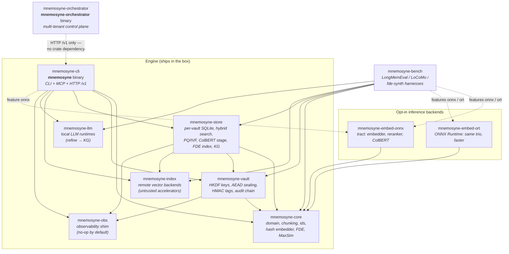
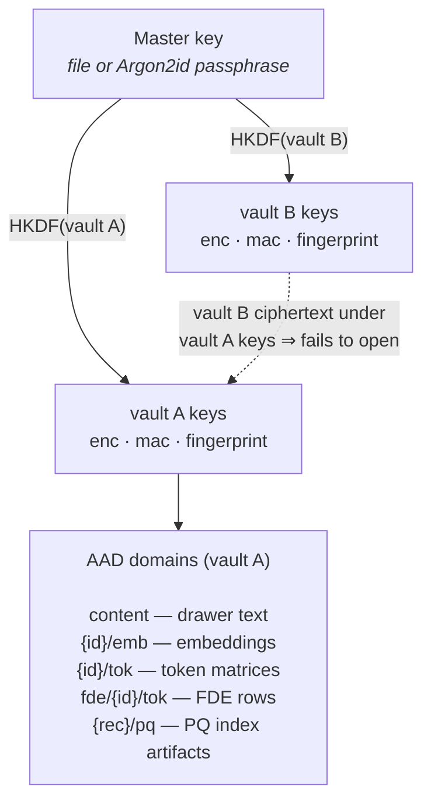
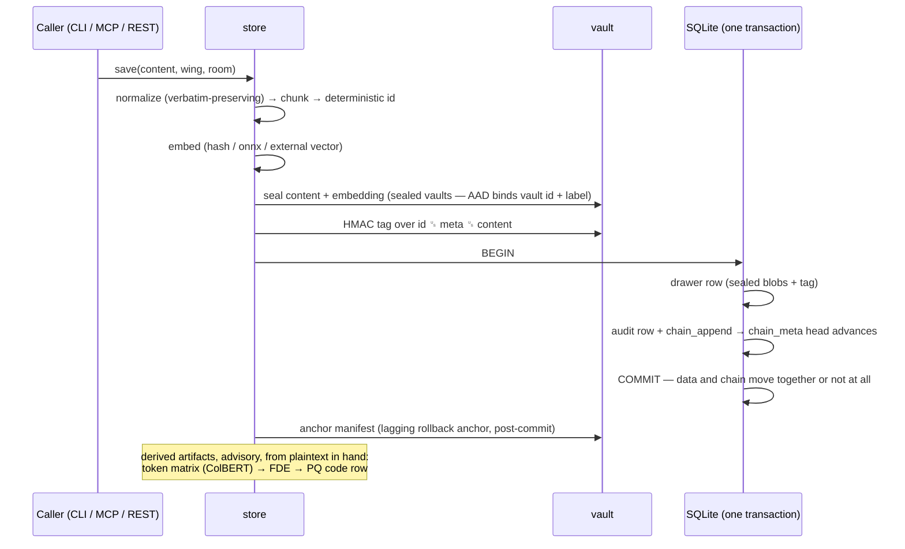
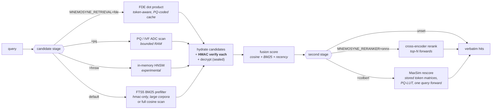

# Architecture

## The palace

```
Palace (data dir, one master key)
└── Vaults (isolation boundary: own DB file, own derived keys)
    ├── Wings   (people / projects)          ── connected by Tunnels
    │   └── Rooms (topics)
    │       └── Drawers (verbatim chunks, ~800 chars)
    ├── Knowledge graph (temporal triples with validity windows)
    ├── Audit chain (append-only, HMAC-chained writes)
    └── Hallways (entity co-occurrence, computed on demand — never persisted)
```

## Components and dependencies

Eleven crates. Solid arrows are `Cargo.toml` dependencies; the dashed
arrow is the one deliberate non-dependency in the design — the
orchestrator talks to engines **only over HTTP** (`/v1`), so the engine
stays tree-blind and portable.



| Crate | Responsibility |
|---|---|
| `mnemosyne-core` | Domain types, chunking, deterministic ids, normalization, hash embedder, MUVERA FDE construction, MaxSim kernel, transcript parsing, entity detection |
| `mnemosyne-vault` | Master key (file or Argon2id), HKDF per-vault keys, XChaCha20-Poly1305 sealing, HMAC tags, audit-chain arithmetic, MAC'd manifests |
| `mnemosyne-store` | Per-vault SQLite (system of record), hybrid search, PQ/IVF prefilter, ColBERT token store + LUT MaxSim, FDE candidate index, knowledge graph, management, remote-index integration |
| `mnemosyne-index` | Qdrant / Chroma / pgvector / Milvus / Weaviate clients — untrusted accelerators, sealed content only |
| `mnemosyne-llm` | Local LLM runtimes (Ollama / OpenAI-compatible) for `refine` → KG extraction |
| `mnemosyne-obs` | Observability shim: zero-dep no-op by default; logs, `/metrics`, OTLP, SSE under `--features telemetry` |
| `mnemosyne-cli` | `mnemosyne` binary: CLI + MCP stdio + HTTP (MCP `/mcp` + multi-tenant `/v1`) |
| `mnemosyne-embed-onnx` | Feature-gated tract backend: sentence embedder, cross-encoder reranker, ColBERT encoder |
| `mnemosyne-embed-ort` | Opt-in ONNX Runtime backend: the same trio, ~2.5× per forward, int8 support |
| `mnemosyne-bench` | Benchmark harnesses (LongMemEval, LoCoMo, ConvoMem, MemBench, fde-synth) |
| `mnemosyne-orchestrator` | Optional multi-tenant control plane: routing, tenant→vault map, token minting, migration |

## Key hierarchy and AAD domains

Isolation is cryptographic, not logical. One master key; every vault
derives its own keys via HKDF, and **every sealing operation binds the
vault id (and an artifact-specific label) into the AAD** — ciphertext
moved across vaults, rows, or artifact kinds fails to open rather than
decrypting wrongly.



Sealed vaults never persist plaintext or plaintext-derived data in clear:
embeddings, PQ code rows and codebooks, ColBERT token matrices, and FDE
rows are all AEAD-sealed under their distinct domains, and search runs
from decrypt-once RAM caches.

## Write path

Every write is verbatim (never summarized), deterministic (same logical
drawer ⇒ same id ⇒ idempotent re-mining), and **atomic with its audit
entry** — the chain head lives in SQLite and advances inside the same
transaction as the data it covers.



Crash between COMMIT and the manifest anchor? The next open replays the
audit rows: an anchor *inside* the replayed chain is a crash artifact
(silent fast-forward); an anchor *outside* it is a rollback or fork
(`ManifestTampered`). A power cut is never a false alarm; a restored old
database still alarms.

## Search pipeline

Candidate generation is pluggable; everything downstream is identical on
every path, and **every candidate's HMAC is verified before its content
is returned**.



The FDE and MaxSim stages share one query forward per search; sealed
vaults serve all of this from decrypt-once RAM caches. Measured numbers
for every stage live in
[RETRIEVAL_SCALING.md](https://github.com/compufreq/mnemosyne/blob/main/docs/RETRIEVAL_SCALING.md).

## Multi-tenant deployment

One engine hosts many cryptographically isolated vaults; fleets add the
optional orchestrator — topology, request routing, and the migration
sequence are diagrammed in
[MULTI_TENANCY.md](https://github.com/compufreq/mnemosyne/blob/main/docs/MULTI_TENANCY.md).
