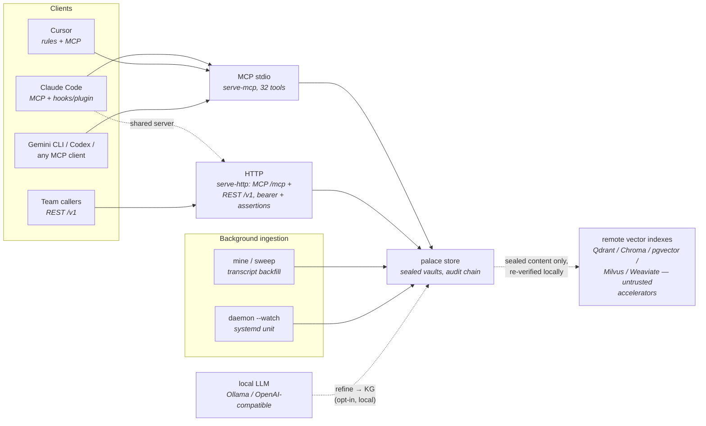

# Integrations

> The [agents implementation guide](https://compufreq.github.io/mnemosyne/docs/agents.html)
> covers each of these surfaces as a step-by-step scenario, with the full
> MCP tool, REST route, and environment-variable reference.

Every integration reaches the same engine through one of three surfaces —
interactive MCP, HTTP, or background ingestion — and they all end at the
same vault-sealed store:



## Claude Code

MCP server: `claude mcp add mnemosyne -- mnemosyne serve-mcp`
Auto-save hooks: `mnemosyne hooks claude-code` prints settings; or install
the plugin from `.claude-plugin/` (commands, hooks, skills, MCP).
Backfill history: `mnemosyne mine ~/.claude/projects --mode convos`, then
per-message recall with `mnemosyne sweep ~/.claude/projects`.

## Cursor

Copy `rules/mnemosyne-recall.mdc` into `.cursor/rules/`; wire the MCP server
in Cursor's MCP settings with command `mnemosyne serve-mcp`.

## Gemini CLI / Codex / any MCP client

Stdio config (see `mcp.json`):

```json
{ "mcpServers": { "mnemosyne": { "command": "mnemosyne", "args": ["serve-mcp"] } } }
```

## Background auto-save without hooks

`mnemosyne daemon run --watch <transcript-dir> --interval 300` — or the
systemd user unit in `deploy/mnemosyne-daemon.service`.

## Team server

See [remote-server.md](remote-server.md).
