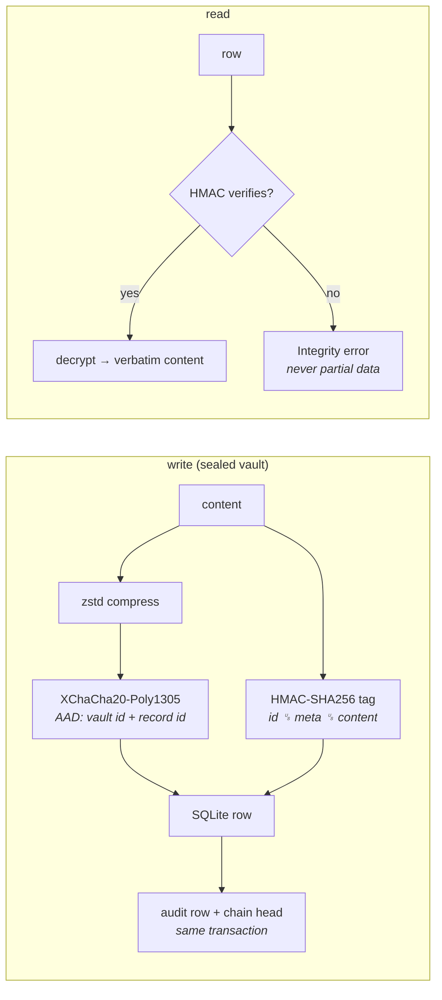
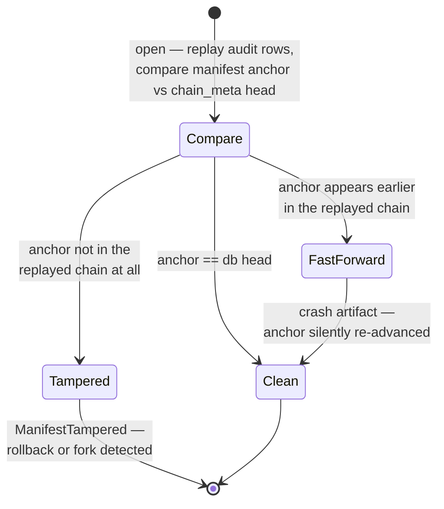
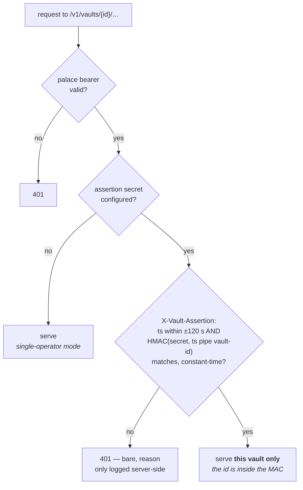

# Security model

## Goals

Protect memories **at rest** against disk theft, cross-vault bleed, and
offline tampering of the database or manifest. Detect (not just resist)
modification: every read verifies, `verify` audits everything.

## Mechanisms

- **Master key**: 32-byte key file (0600) or Argon2id(passphrase, salt),
  64 MiB / t=3. Keys zeroized on drop; never logged.
- **Per-vault keys**: `HKDF-SHA256(master, vault_salt, "mnemosyne.v1/vault/<id>/<label>")`
  for enc / mac / manifest labels. Vaults never share working keys.
- **Compression**: sealed content is zstd-compressed *before* encryption
  (compress-then-encrypt; the reverse leaks nothing but gains nothing).
  Note the standard caveat: at-rest sizes correlate weakly with content
  compressibility.
- **Sealing**: XChaCha20-Poly1305, random 24-byte nonce, AAD binds
  `vault_id + record_id` — ciphertext cannot be replayed across vaults or
  record slots. Sealed vaults encrypt content *and* embeddings; nothing
  content-derived is written to disk in plaintext (no FTS index either).
  hmac-only vaults — which store plaintext by choice — keep an FTS5 BM25
  prefilter index. Like embeddings, it is derived data outside the HMAC
  envelope: tampering with it can hide records from *search* (an
  availability attack, self-healed by an index rebuild) but can never
  forge a record, since every returned row still verifies its HMAC.
- **Integrity**: HMAC-SHA256 per record (independent key) over
  id + metadata + at-rest content; append-only audit table; chain head
  `h_i = HMAC(mac, h_{i-1} || tag_i)` stored in a MAC'd manifest. Deletions
  log keyed tombstones. KG triples and tunnels carry tags too.
- **Duplicate detection** uses keyed fingerprints (truncated HMAC), so
  stored fingerprints reveal nothing offline.

What one record goes through, at rest and on read:

The audit chain reconciles at every open — a crash is never a false
alarm, a rollback always is one:

- **Remote indexes** receive sealed bytes + plaintext embeddings only;
  results are re-verified locally. See the trade-off note in the README.
- **HTTP server**: refuses non-loopback binds without a bearer token;
  `--read-only` strips all mutating tools.

## Server auth model (two layers)

The HTTP server distinguishes *reaching the server* from *addressing a
tenant*:

1. **Palace-wide bearer** (`MNEMOSYNE_MCP_HTTP_TOKEN`) — mandatory for any
   non-loopback bind, gates every authenticated route (MCP and REST).
   Proves the caller reached the right server; it does not distinguish
   vaults, so on its own whoever holds it can address every vault.
2. **Per-vault assertion** (`MNEMOSYNE_ASSERTION_SECRET`, optional) — when
   set, every `/v1` request must carry
   `X-Vault-Assertion: <ts>:<HMAC-SHA256(secret, "<ts>|<vault_id>")>` for
   the exact vault it addresses. The vault id is bound into the MAC, so an
   assertion for vault A cannot authorize vault B; timestamps outside ±120s
   are refused; comparison is constant-time. The caller platform authorizes
   its user and mints the assertion, and the engine verifies independently
   — a compromised caller component without the secret gets nothing. This
   is what makes a multi-tenant host (vault = customer) safe: the engine,
   not the caller, enforces per-tenant access on every request. Failures
   return a bare 401; the reason is logged server-side, never returned (it
   would leak vault existence or how close a forgery got).

Fusion and external-embedding vaults do not change any of this: search only
re-ranks already-HMAC-verified candidates, and caller-supplied vectors are
sealed exactly like internally-computed ones.

## Non-goals

An attacker reading process memory while a vault is unlocked; a compromised
host OS; traffic analysis of remote-index queries; embedding-inversion
resistance for vectors pushed to remote indexes (documented, opt-in).

## Levels

`sealed` (default): everything above. `hmac-only`: plaintext content with
full integrity tagging + chain — for vaults where grep-ability outweighs
confidentiality.
