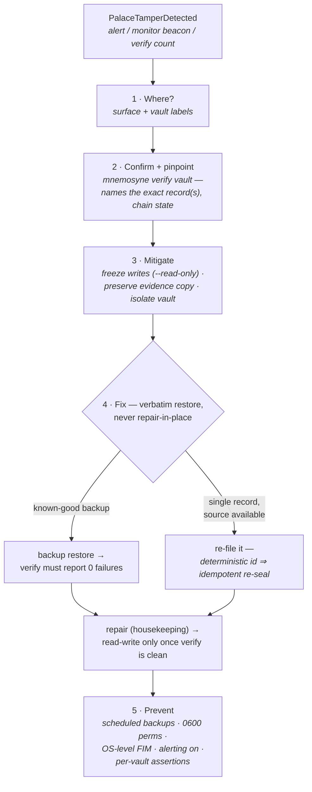

# Tamper runbook

When Mnemosyne raises **`PalaceTamperDetected`** (or the Palace Monitor's
ambulance beacon lights, or `mnemosyne verify` reports a non-zero `hmac
failures` count), a stored record failed its HMAC integrity tag on read. Treat
it as **on-disk tampering until proven otherwise**. This page is what the
alert's `runbook_url` points to.

> Integrity is cryptographic, not advisory: every drawer, KG triple, tunnel,
> and vault manifest carries an HMAC-SHA256 tag, and every write joins a
> tamper-evident audit chain. A verify failure means the bytes on disk no
> longer match what Mnemosyne sealed.

The whole procedure at a glance — each step is detailed below:



## 1. Where did it happen?

The alert carries two labels that localize the failure:

- **`surface`** — which structure failed: `drawer`, `kg`, `tunnel`, or
  `manifest`.
- **`vault`** — which vault (on the live event stream / Palace Monitor).

In Grafana, the **“Tamper by surface”** panel and the **HMAC verify failures**
stat show the same signal; the **Logs** panel shows the
`integrity failure — HMAC verification failed on <surface>` line.

## 2. Confirm and pinpoint the record

Run a full verification of the affected vault — it re-checks every record's
HMAC and replays the audit chain, naming the exact bad record(s):

```bash
mnemosyne verify <vault>
# records checked: 1284
# hmac failures:   1
#   TAMPERED: 5a2fc91d…
# audit chain:     BROKEN
```

The named id is the tampered record; a `BROKEN` audit chain tells you the
tamper also broke chain continuity (an attacker who edited content but couldn't
forge the chain MAC).

## 3. Mitigate now (stop the bleeding)

1. **Freeze writes.** Restart the server read-only so nothing new is written on
   top of a compromised store while you investigate:
   ```bash
   mnemosyne serve-http --read-only …
   ```
2. **Preserve evidence.** Copy the vault directory *before* changing anything —
   the DB, its `-wal`/`-shm`, and `vault.json`:
   ```bash
   cp -a "$MNEMOSYNE_HOME/vaults/<vault>" "/tmp/<vault>.evidence.$(date +%s)"
   ```
3. **Isolate.** If this is a multi-tenant server, the vault id in the alert
   scopes the blast radius — other vaults have independent HKDF-derived keys, so
   one vault falling tells an attacker nothing about its siblings.

## 4. Fix (restore verbatim)

Mnemosyne never lossily transforms your data, so the fix is a **verbatim
restore**, not a repair-in-place of forged bytes:

1. **Restore from the most recent good backup.** `backup` refuses to run if the
   source failed verification, so a listed backup is known-good at capture time:
   ```bash
   mnemosyne backup list
   mnemosyne backup restore <vault> <backup-id>
   mnemosyne verify <vault>          # must now report 0 hmac failures, chain ok
   ```
2. **If a single record was hit and you have the source**, re-file it (the
   drawer id is deterministic, so re-mining is idempotent and re-seals it) and
   re-verify.
3. **Housekeeping** after a clean restore:
   ```bash
   mnemosyne repair <vault>          # backfill fingerprints, vacuum, re-verify
   ```

Only return the server to read-write once `verify` is clean.

## 5. Prevent (before the next time)

- **Back up on a schedule.** `mnemosyne backup create <vault>` is the recovery
  path above; without a good backup, a verbatim restore isn't possible.
- **Lock down the store.** The vault directory and `master.key` should be
  `0600`/owner-only. Anything that can write the vault DB out-of-band can
  tamper; anything that can read `master.key` can forge.
- **Add OS-level file-integrity monitoring** (auditd / a tripwire) on the vault
  directory — Mnemosyne catches tamper on *read*; FIM catches the *write*.
- **Keep telemetry alerting on.** `PalaceTamperDetected` fires within a scrape
  interval — that early signal is the point.
- **Use per-vault assertions** for multi-tenant deployments so a compromised
  client can't reach another tenant's vault.

## The guarantee

Tamper-evidence only works if the alarm is trustworthy — so Mnemosyne only ever
raises it on a **real** HMAC-verify failure. There are no synthetic or demo
tamper alarms anywhere in the system: metrics, the live event stream, and the
Palace Monitor beacon all read the same `hmac_verify_failures` signal.
